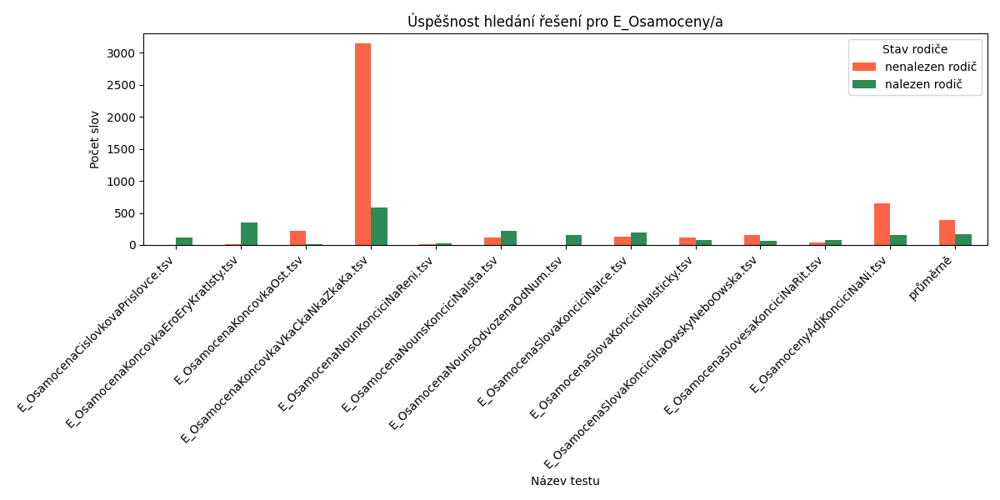
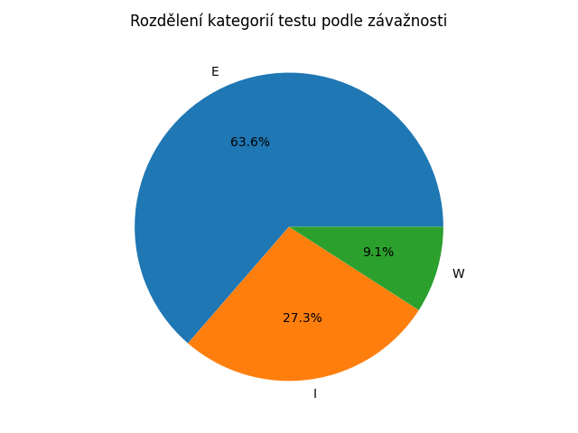
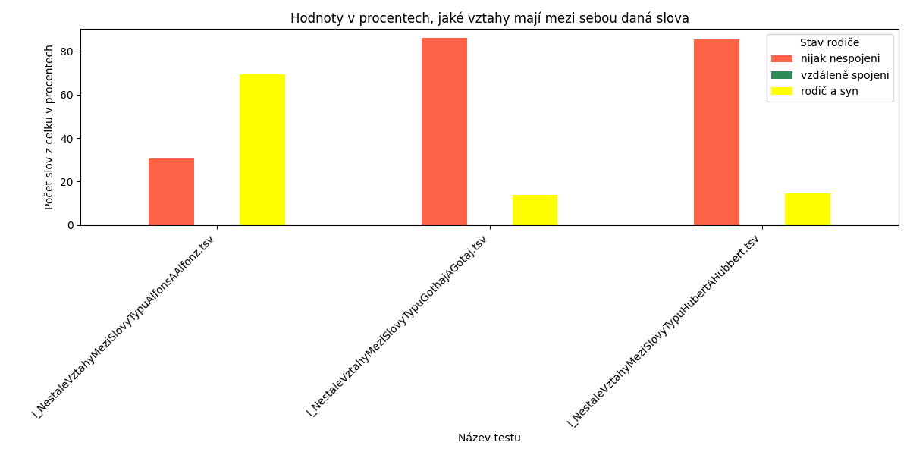
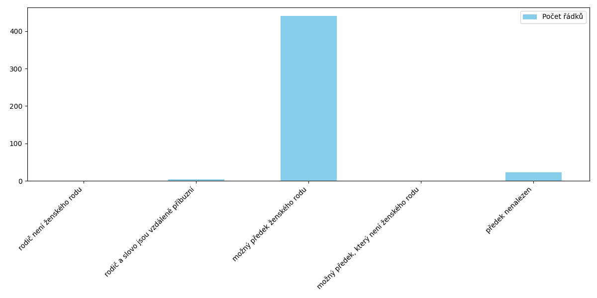
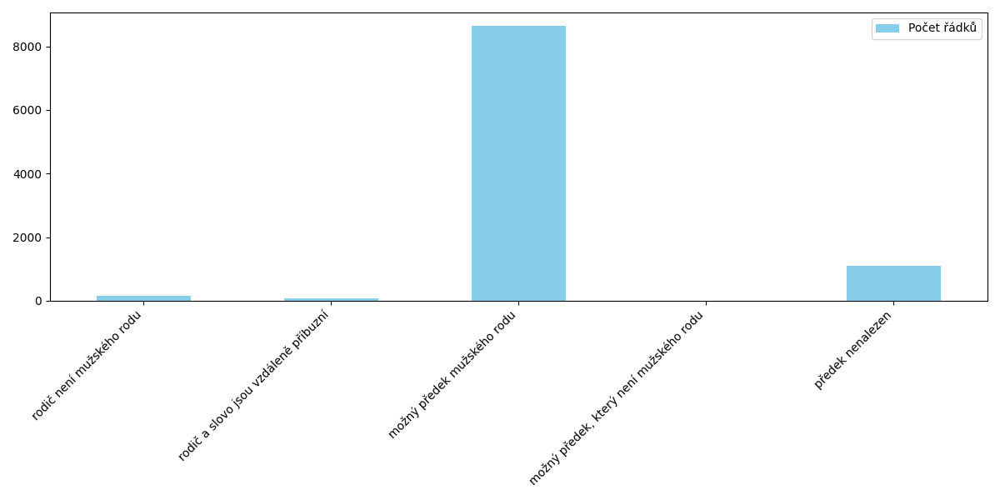

## 
Závěrečná zpráva o ročníkovém projektu

### 
Aneta Řeháková

### Popis a zaměření

*DeriNet* je lexikální síť modelující slovotvorné vztahy mezi slovy z českého jazyka. Základní jednotkou této sítě je lexém, jenž obsahuje informace o jednotlivých slovech. V tuto chvíli se v aktuální verzi databáze *DeriNet 2.3*, již jsem sama používala, nachází přes 1 milion lexémů.

Kvůli takové rozsáhlosti sítě není možné vztahy mezi jednotlivými slovy zadávat a kontrolovat ručně, a tak některé vztahy chybí, nebo naopak přebývají. Mým úkolem bylo sepsat sadu testů, které tyto chyby odhalí a, pokud to bude možné, najdou i možná řešení.

### Použité technologie

- Samotná databáze DeriNet 2.3
  - Získána z této webové stránky: <https://lindat.mff.cuni.cz/repository/items/62540779-b206-4cf7-ac33-399ce68e35e6>
- API pro přehlednější komunikaci a přístup s databází
  - Získáno z této webové adresy: <https://github.com/vidraj/derinet/tree/master/tools/data-api/derinet2#usage>
  - Před používáním doporučeno se seznámit s popisem na uvedené webové adrese
- Python (jazyk využitý při psaní a vykonávaní testů)

*Databáze DeriNet 2.3*

Jak jsem již zmínila, základní jednotkou v databázi je lexém, kde se schraňují informace o jednotlivých slovech, které jsou pro mé testy signifikantní.

Tyto poznatky můžeme rozdělit na ty **týkající se pouze daného lexému** (které se dále dělí na editovatelné a needitovatelné) a na ty **zabývající se vztahy mezi lexémy**.

Do první kategorie patří tyto informace

- informace již neměnitelné
  - *lemma* – základní podoba slova
  - *lemid* – kombinbace lemma + morfologický tag podle Prague Dependency Treebank (PDT)
  - *pos* – slovní druh
- editovatelná data
  - *feats* – základní informace (mluvnické kategorie anebo zda je slovo cizího původu)
  - *segmentation* – segmentace slova na morfémy (nejmenší vydělitelná část slova, která je nositelem věcného nebo gramatického významu)
  - *misc* – statistika o slově v korpusu (absolutní počet výskytů, jak časté dané slovo je oproti ostatním anebo relativní frekvence)

Do druhé kategorie patří tyto data

- *all_parents* – seznam obsahující všechny lexémy, z nichž vzniklo zkoumané slovo
- *parent* – hlavní předek daného slova (nejvýznamnější, pokud jde o vztah skládání, a jediné, pokud jde o vztah odvozovací)
- *all_children* – seznam všech lexémů, jimž je dané slovo předkem

Ve svých testech využívám hlavně *parent, feats, misc, pos a lemma*.

### Testy

*Spouštění testů*

Pro tento účel se ve složce *final* nachází soubor *Makefile*, který po spuštění stáhne všechny potřebné závislosti, poté spustí generování výstupních souborů a nakonec vytvoří grafové statistiky. 

Pro to, aby člověk mohl využít souboru *Makefile*, potřebuje být schopen na příkazové řádce ve složce *final* spustit *make all*. 

*Název testů*

Názvy jsou vymyšleny tak, aby bylo na první pohled poznat, co se v daném testu kontroluje. Prvním písmeno určuje vážnost chyby, viz. níže.

*Struktura samotných testů*

- Načtení databáze

Jelikož jsem celou dobu pracovala s databází přes API, bylo potřeba pro každý test nejdříve danou databázi načíst. To zabere nemálo času, nakonec jsem se rozhodla pro jedno načtení databáze před spuštěním všech testů. Každý test získá lexicon jako objekt pro rychlejší průběh.

- Hlavní část – logika testu

Každý program se v této části liší. Někdy se zde kontroluje, zda lexém, který by měl mít podle mé teorie předka, ho opravdu má, a pokud ne, tak se zkusí najít možný předek. Nebo naopak, zda daný lexém na sebe nemá špatně napojeného potomka, a pokud ano, tak co by měl být pro potomka správný předek.

Výstupem této části je jeden až několik seznamů, které obsahují slova nalezena daným testem.

- Výpis

Pro přehlednost každý test vypisuje svůj výstup do souboru se stejným názvem. Nejprve se do souboru napíše, co bylo cílem daného testu a jak bude výstup strukturován. Poté se přejde k vypsání nalezených slov.

Výpis se nejčastěji dělí na slova, která skoro jistě spadají do této chyby a/nebo k nim bylo nalezeno řešení, a poté na slova, jež je potřeba více zkontrolovat a/nebo k nim nebylo nalezeno řešení. Obě kategorie jsou od sebe odděleny.

Pro lepší práci, se výstup vypisuje do souboru formátu *.tsv*.

*Rozdělení podle vážnosti chyby*

Ne všechny testy odhalují chyby na stejné úrovni vážnosti, a proto jsem rozdělila testy do tří skupin

- _Info_ – testy obsahující malé množství chyb, anebo pozorování o zvláštních jevech, jichž jsem si za tu dobu všimla (nemusí to být vyloženě chyba, ale stojí to za zaznamenání)
- _Warning_ – testy naznačující chybějící vztahy (něco pravděpodobně chybí)
- _Error_ – testy ukazující na vztahy, které by se v databázi neměly nacházet (něco pravděpodobně přebývá)

Určená skupina pro daný test se nachází na prvním místě názvu daného testu.

### Statistiky

*Úspěšnost nalezení možného řešení pro jeden typ testů*

Nejčastěji jsem testovala slova podle koncovek. Například přídavná jména končící na ‚čin‘ by měla být připojena k podstatnému jménu. Ne pro všechna slova, která tyto testy našly, se mi podařilo najít možného předka.

Přikládám tedy graf podle (ne)nalezení možného předka u deseti náhodně vybraných testů zabývající se podobnou myšlenkou, a k tomu průměrné hodnoty.

Jde vidět, že ačkoliv všechny testy jsou na stavěné na podobný typ chyby, neznamená to, že najdou podobný počet hodnot.

*Kategorie*

Jak již bylo zmíněno, neexistuje jednotná kategorie, přikládám tedy koláčový graf, na kterém jde vidět, jaké rozložené v počtu vzniklých výstupních souborů mezi kategoriemi 

*Nejasný typ vztahu*

V databázi se nachází spoustu slov, které se liší pouze vynechaným h, tedy například *gothaj* a *gotaj*, nebo změnou z *z* na *s* anebo odebráním zdvojeného písmena. Jde vidět, že neexistuje jednotné pravidlo, jak a zda vůbec by tato slova měla být spojena. Napsala jsem tedy test, který tyto úkazy v databázi projde a poté seřadí jednotlivé kategorie podle toho počtu slov.

*Přídavná jména končící na 'čin' a 'ův'*

Tato přídavná jména by měla být připojena pod podstatným jménem rodu ženského, respektive rodu mužského. Stejně jako u předchozího příkladu, však neexistuje jednotné pravidlo. Často slovům rodič chybí, poté jejich hlavním rodičem není očekávaný typ slova anebo jsou vzdáleně příbuzní. 

Pro oba případy přikládám grafy popisující rozložení těchto případů.

